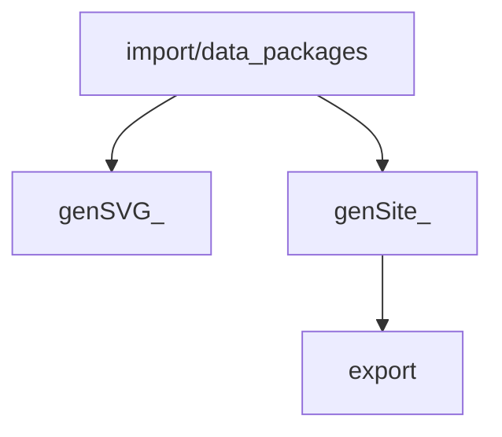

# Document Flow Diagram
This diagram is an auto-generated from directory structure of `flow` directory and links present in `input` and `output` sub-folders (tasks). Click the box (task) to explore more.

